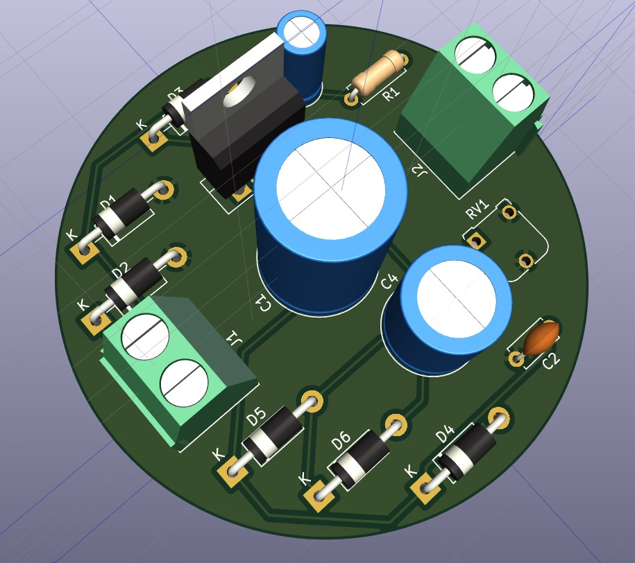

# ESD - Electronic System and Design (SEM - 6)

## Exp 1 : Center-Tapped Full Wave Rectifier

## Exp 2 : Voltage Regulator

## Exp 3 : Amplifier

## Exp 4 : 5V Regulated Power Supply

## Exp 5 : DIY PCB Making of Exp 1

## Exp 6 : DIY PCB Making of Exp 2

## Exp 7 : Voltage Regulator Using SCR

## Exp 8 : Fire Alarm Mini Project

## Exp 9 : Audio Amplifier

